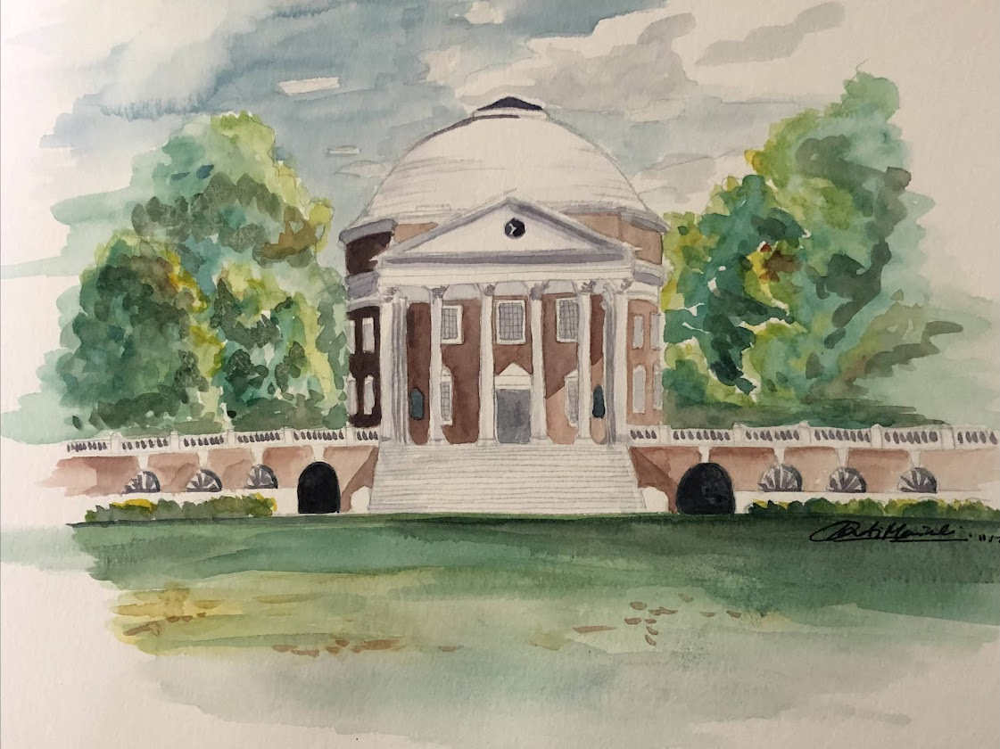
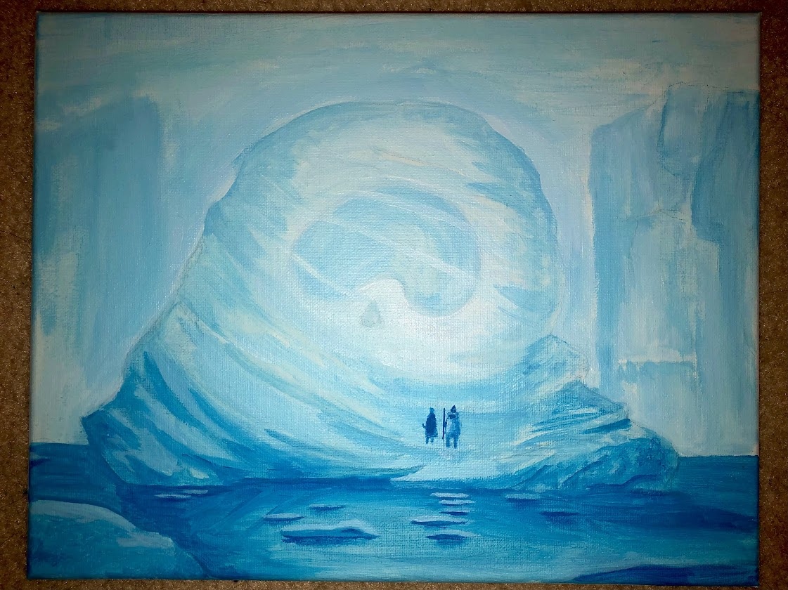
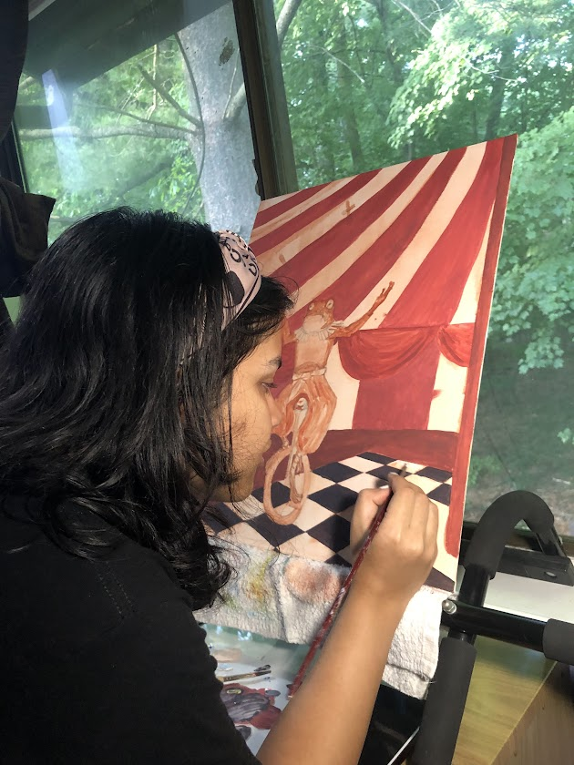
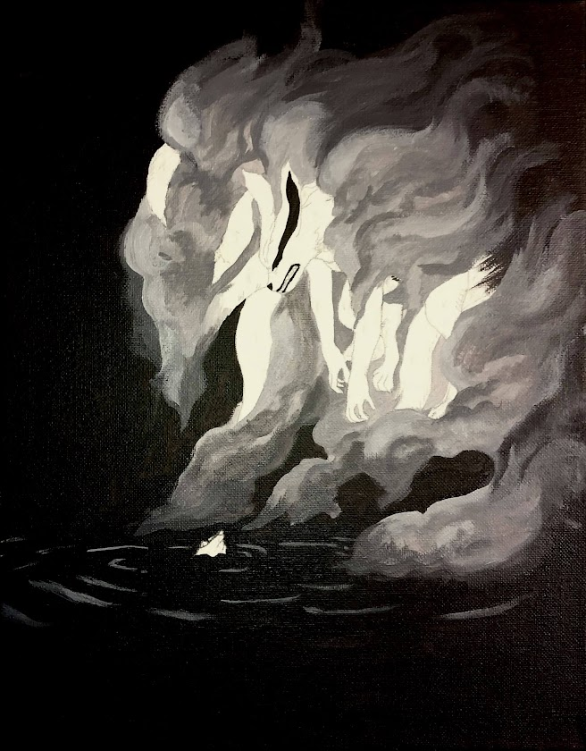

------------------------------------------------------------

### About:

------------------------------------------------------------

Hi! My name is Pradeeti Mainali. I am currently a second year student at Columbia University Mailman School of Public Health. I am pursuing an MPH in Epidemiology with a certificate in Applied Biostatistics and Public Health Data Science, which I will complete in May 2025.

I also graduated from the University of Virginia in May 2023 with a Bachelor of Arts in Global Studies, Public Health. 

------------------------------------------------------------

### Hobbies:

------------------------------------------------------------

In my free time, I love to watch TV, listen to music, and paint. 

Currently I am watching Agatha All Along and Brooklyn 99. I really enjoy watching Bollywood movies and k-dramas as well.

I'm into a lot of music genres such as pop, rap, indie, rock, some dance, and a little bit of metal occasionally... 

#### Painting Gallery:  

UVA (watercolor):

Iceberg scene from Avatar the Last Airbender (acrylic):

Action shot my mom took of me (acrylic):

Kurama from Naruto (acrylic):

------------------------------------------------------------

### Websites:

------------------------------------------------------------

[Linked In](https://www.linkedin.com/in/pradeetim/)

[GitHub](https://github.com/pradeetim)

